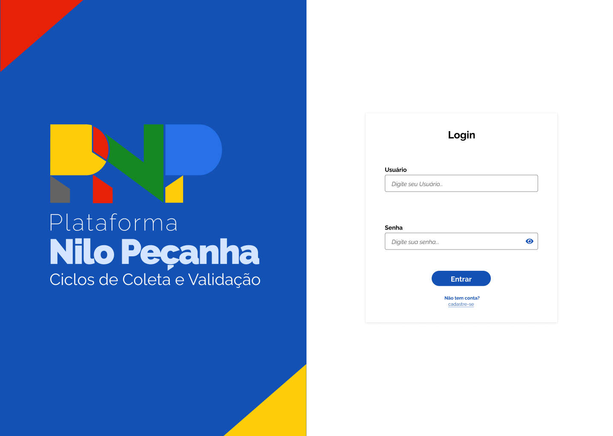

# HU 0002 - Login de Usuário

### Histórico de Alterações

| Data | Autor | Observação |
| ----- | ----- | ------------ |
| 14/06/26 | Pedro Ricardo - @Ppedrocoder | Criação da ISSUE e escrita da HU |

## 1. Especificação da História de Usuário

- **Como:** Usuário do site
- **Quero:** Entrar na minha conta cadastrada
- **Para:** Acessar as funcionalidades exclusivas do sistema

 

## 2. Cenários

### **2.1. Logar Usuário**

- **DADO** Que sou um usuário do site
- **QUANDO** Preencho o formulário de login com um nome de usuário e senha
- **E** Clico no botão de entrar
- **ENTÃO** O sistema salva as informações e me redireciona para o feed.

 

## 3. Critérios de Aceitação:

- [x] **3.1.** O usuário deve ser logado.

- [x] **3.2** O usuário deve ser redirecionado pro feed.

 

## 4. Especificações Técnicas:

### 4.1. Campos do Formulário de Autocadastro de Usuário:

| Campos               | Descrição                              | Tipo de Campo | Tipo do Dado | Tamanho | Máscara | Editável | Obrigatório | Regras |
| -------------------- | -------------------------------------- | ------------- | ------------ | ------- | ------- | -------- | ----------- | ------ |
| Usuário              | Nome do usuário usado para fazer login | Texto         | Alfanumérico | N/A     | N/A     | S        | S           | [RN 1](../regras-negocio.md#rn-1) |
| Senha                | Senha do usuário                       | Texto         | Alfanumérico | N/A     | Senha   | S        | S           | N/A    |

 

## 5. Protótipos
- Tela de login

