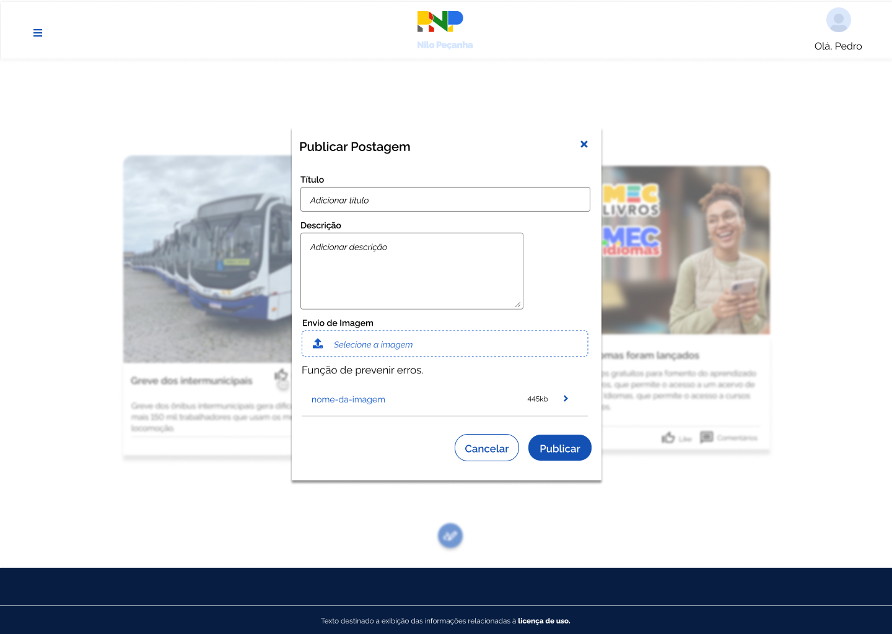
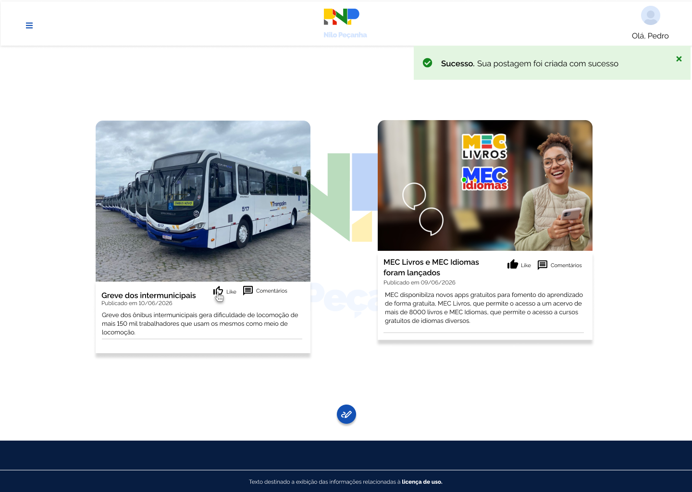

# HU 0003 - Publicar Postagens

### Histórico de Alterações

| Data | Autor | Observação |
| ----- | ----- | ------------ |
| 12/06/26 | Pedro Ricardo - @Ppedrocoder | Criação da ISSUE e escrita da HU |  

## 1. Especificação da História de Usuário

- **Como:** Usuário autenticado no site
- **Quero:** Realizar a publicação de uma postagem 
- **Para:** Aparecer no feed do site

 

## 2. Cenários

### **2.1. Escrever Postagem**

- **DADO** Que sou um usuário autenticado no site
- **QUANDO** Preencho o formulário de criação de postagens
- **E** Clico no botão de publicar
- **ENTÃO** O sistema salva as informações e exibe a mensagem de sucesso.

 

## 3. Critérios de Aceitação:

- [x] **3.1.** A postagem deve ser criada.
- [x] **3.2.** Uma mensagem de confirmação deve ser exibida.

 

## 4. Especificações Técnicas:

### 4.1. Campos do Formulário de Criação de Postagens:

| Campos               | Descrição                              | Tipo de Campo | Tipo do Dado | Tamanho | Máscara | Editável | Obrigatório | Regras |
| -------------------- | -------------------------------------- | ------------- | ------------ | ------- | ------- | -------- | ----------- | ------ |
| Título               | Nome atribuído a postagem | Texto         | Alfanumérico         | Até 200 caracteres | N/A  | N        | S           | N/A    |
| Descrição                | Descrição da postagem                  | Texto         | Alfanumérico | Até 1200 caracteres | N/A    | N        | S           | N/A    |
| Imagem                 | Imagem que será atribuída a postagem    | Imagem         | Matricial    | Até 2 MB     | N/A       | N        | N           | N/A    |

 

## 5. Protótipos
- Formulário para publicação de posts

- Após criar a postagem

