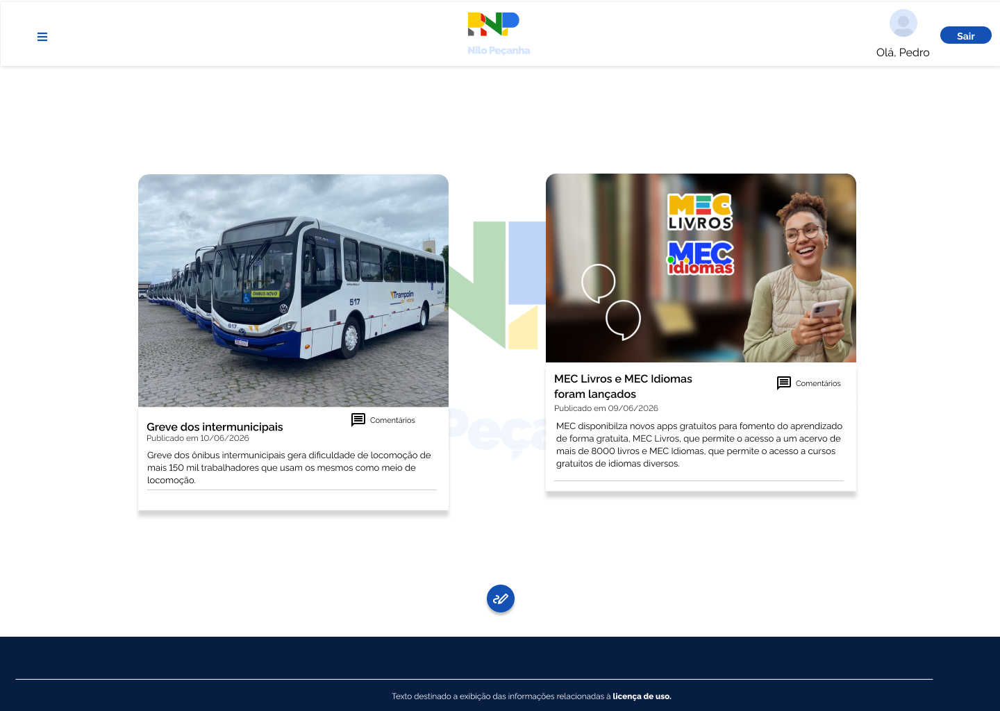

# HU 0005 - Visualizar Postagens

### Histórico de Alterações

| Data | Autor | Observação |
| ----- | ----- | ------------ |
| 12/06/26 | Pedro Ricardo - @Ppedrocoder | Criação da ISSUE e escrita da HU |  
| 14/06/26 | Pedro Ricardo - @Ppedrocoder | Correções | 

## 1. Especificação da História de Usuário

- **Como:** Usuário autenticado do site
- **Quero:** Visualizar, no feed, as postagens publicadas 
- **Para:** Consumir tanto minhas postagens como de outros usuários

 

## 2. Cenários

### **2.1. Visualizar Postagem**

- **DADO** Que sou um usuário autenticado
- **QUANDO** Entro no site
- **E** Estou no feed
- **ENTÃO** Vejo as postagens publicadas no site

 

## 3. Critérios de Aceitação:

- [x] **3.1.** As postagens tanto minhas como de outros usuários são visíveis no feed.

 

## 4. Especificações Técnicas:

#### Regra de Negócio - [RN 3](../regras-negocio.md#rn-3)

## 5. Protótipos
- Feed de Postagens

